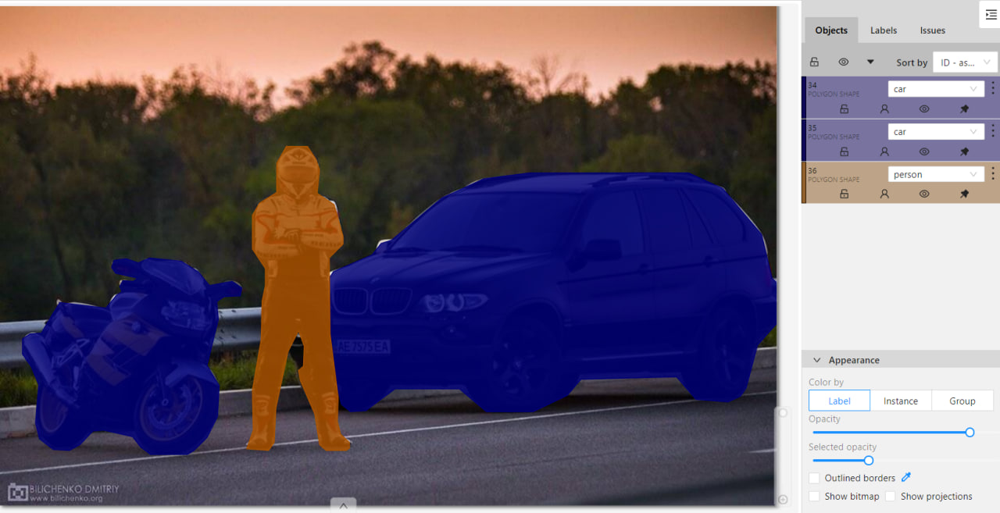
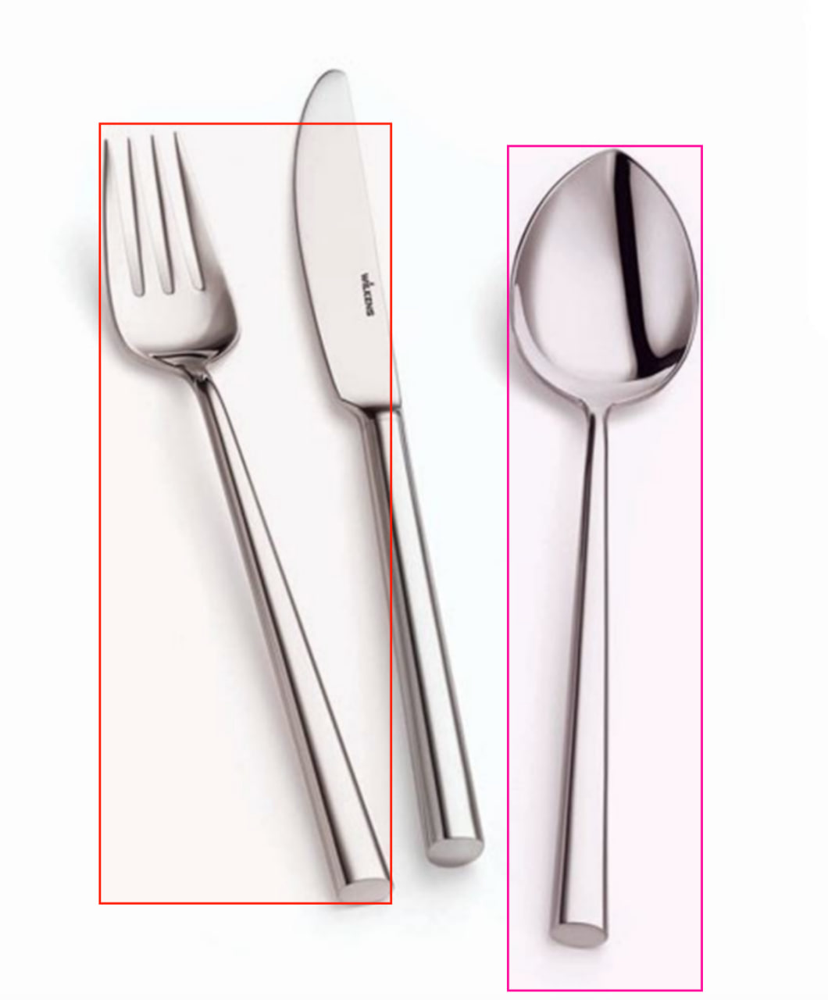

# __Auto-labling CVAT__

Creating __automatic annotation in CVAT__ using pre-trained [ultralytics models][1]. It supports both bounding box annotation for __object detection__ tasks and polygon annotation for __instance segmentation__ tasks.

You need to provide the path to the folder with images that will be uploaded to the task in CVAT. As a result of the program's operation, a zip archive with annotations obtained based on the neural network inference will be formed.

All that remains to be done: after creating the task, go to the Actions panel and select `Upload annotations`. Then, choose `COCO 1.0` in the `Import format` section and upload the archive.


## Installation:
You need to have Python 3.8 or newer installed.
Run the following commands sequentially in your terminal:

1. Clone this repository to your local machine.
2. Navigate to the created folder using the command cd.

Install all necessary libraries:

```pip install -r requirements.txt```

__This repository supports all relevant models from Ultralytics:__ YOLOv8/v9/v10 (and lower) for detection and segmentation, FastSAM, and YOLO-World (Real-Time Open-Vocabulary Object Detection).

## How to run the code:
To interact with the repository, you need to set the following command in the cmd terminal:
```
python AutoCvat.py --img_folder="images" --weights=yolov8m-seg.pt --yaml_pth=configs.yaml
```
An example of a more fine-tuning with all possible CLI parameters:
```
python AutoCvat.py --img_folder=images --weights=yolov8m-seg.pt --annotations_zip=cars_annotations --yaml_pth=configs.yaml --all_conf=0.2 --cvat_json=True --save_photo=True
```

Table 1. Explanation of CLI command values:

| № | Command               | Description                                                                                   | Default value|
|---|-----------------------|-----------------------------------------------------------------------------------------------|--------------|
| 1 | img_folder  | Path to the folder containing images                                                            |  -           |
| 2 | weights     | Path to the ultralytics model weights file (ex: yolov8m-seg.pt, yolov9c.pt, FastSAM-x.pt)       |  -           |
| 3 | yaml_pth       | The path to configuration yaml file                                                             | configs.yaml |
| 5 | save_photo      | Whether to create a file .zip photos to upload to CVAT                                          | False        |
| 5 | cvat_json     | Should a json file with labels for CVAT be created                                              | False        |
| 6 | all_conf    | The value of the confidence of all model classes, condidences from config file don`t use | 0.5          |

For Russian users, there is a detailed video presentation of this project. YouTube video in Russian is available at this [link]().

## Configuration file

The project also provides a configuration file where the parameters each class in your custom or pretrained YOLO model, confidentiality for each class, the iou parameter are set, parameter "minimize_points", that includes the ability to minimize the number of points in the polygons of the final markup (True is advised) and "segment" parameter, which sets the issue you want to solve True - instance segmentation, False - detection

An example of configuring a configuration file to configure defined classes and make the model confident in their presence:
```
names:
  0: person
  1: bicycle
  2: car
  3: motorcycle
  14: bird
confs:
  0: 0.7
  1: 0.4
  2: 0.4
  3: 0.5
  14: 0.6
iou: 0.7
minimize_points: False
segment: False
```
The keys in the "names" are the numbering of the classes in your model, and the values are the names in the CVAT project (`predictions.boxes.cls.cpu().int().tolist()`)
The keys in the "confs" are also the numbering of the classes, and the values are the confidence parameter of each class of the model.

**It is important to note that the number of confidentiality parameters must match the number of class names.**

If the "segment" parameter is True, but your model only supports detection, the output you will receive the annotations from the detector.

**If you solve the detection issue, you do not need to use "minimize_points" parameter. It only applies to the segmentation task**

## Сlasses combining 
You can also combine several classes into one by giving them the same name in the configuration class, as in the example:

```
names:
  0: person
  1: car
  2: car
  3: car
  14: bird
confs:
  0: 0.7
  1: 0.4
  2: 0.4
  3: 0.5
  14: 0.3

iou: 0.7
minimize_points: True
segment: True
```
At the exit you will get:


If you need to get the annotations of specific classes from YOLO, then you can see their numbers:
[COCO classes supported by YOLO models][2] 

## A good way to start model customization (YOLO-World)

To speed up your pipeline cycle of annotation, training and model improvement. A good solution is to use the [YOLO-World model][3]. This model allows you to detect any object in the image based on descriptive texts.

To get started you need to install the clip library:

```pip install git+https://github.com/openai/CLIP.git```

After that, set the classes that you want to detect and save your custom model:
```
from ultralytics import YOLO

# Initialize a YOLO-World model
model = YOLO("yolov8s-world.pt")  # or select yolov8m/l-world.pt

# Define custom classes
model.set_classes(["dinosaur", "piano"])

# Save the model with the defined offline vocabulary
model.save("custom_yolov8s.pt")
```
Then you can use AutoCvat to get the annotations using custom weights:



## How to create lables for your CVAT project
If you will set cli command `--cvat_json=True`, you will get json file containing everything you need to create a project for your auto annotations.
The contents of the json file must be inserted in "Raw" in the header of the project you created in CVAT:


[1]: https://docs.ultralytics.com/models/
[2]: https://github.com/ultralytics/ultralytics/blob/main/ultralytics/cfg/datasets/coco.yaml
[3]: https://docs.ultralytics.com/models/yolo-world/
