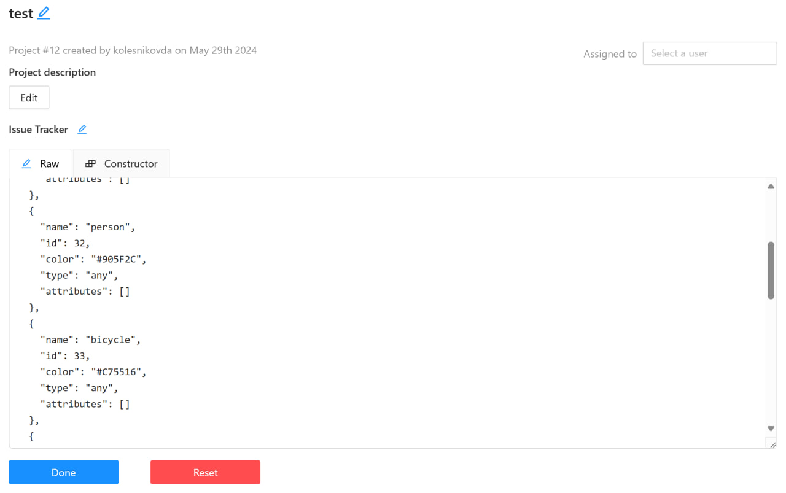

# Auto-labling CVAT
Auxiliary tool, auto-labling. 
Intended use: for tasks related to the training of custom solutions based on [Yolo models][1]  
What it does: implements the inference and converts the output to the Coco 1.0 format supported by CVAT

## Local Setup
You need to have Python 3.8 or newer installed.
Run the following commands sequentially in your terminal:

1. Clone this repository to your local machine.
2. Navigate to the created folder using the command cd.

Install all necessary libraries:

```pip install -r requirements.txt```

This repository supports all relevant models from Ultralytics: YOLOv8/v9(and lower) for detection and segmentation, FastSAM, and YOLO-World (Real-Time Open-Vocabulary Object Detection).

## How to run the code:
To interact with the repository, you need to set the following command in the cmd terminal:
```
python AutoCvat.py --img_folder="images" --weights=yolov8m-seg.pt  --yaml_pth=configs.yaml
```
An example of a more fine-tuning with all possible CLI parameters:
```
python AutoCvat.py --img_folder=image_cars --weights=yolov8m-seg.pt --annotations_zip=cars_annotations --yaml_pth=configs.yaml --default_conf=0.2 --cvat_json=True --cvat_json=True
```

Table 1. Explanation of CLI command values:

| № | Command               | Description                                                                                   | Default value|
|---|-----------------------|-----------------------------------------------------------------------------------------------|--------------|
| 1 | --img_folder=       | Path to the folder containing images                                                            |  -           |
| 2 | --weights=          | Path to the ultralytics model weights file (ex: yolov8m-seg.pt, yolov9c.pt, FastSAM-x.pt)       |  -           |
| 3 | --yaml_pth=         | The path to configuration yaml file                                                             | configs.yaml |
| 5 | --save_photo=       | Whether to create a file .zip photos to upload to CVAT                                          | False        |
| 5 | --cvat_json=        | Should a json file with classes for CVAT be created                                             | False        |
| 6 | --default_conf=     | The default value of the confidence of all model classes                                        | 0.5          |

For Russian users, there is a detailed video presentation of this project. YouTube video in Russian is available at this [link]().

# Configuration file

The project also provides a configuration file where the parameters each class in your custom or pretrained YOLO model, confidentiality for each class, the iou parameter are set, parameter "minimize_points", that includes the ability to minimize the number of points in the polygons of the final markup (True is advised) and "segment" parameter, which sets the issue you want to solve True - instance segmentation, False - detection

An example of configuring a configuration file to configure defined classes and make the model confident in their presence:
```
names:
  0: person
  1: bicycle
  2: car
  3: motorcycle
  14: bird
confs:
  0: 0.7
  1: 0.4
  2: 0.4
  3: 0.5
  14: 0.6
iou: 0.7
minimize_points: False
segment: False
```
The keys in the "names" are the numbering of the classes in your model, and the values are the names in the CVAT project (`predictions.boxes.cls.cpu().int().tolist()`)
The keys in the "confs" are also the numbering of the classes, and the values are the confidence parameter of each class of the model.

It is important to note that the number of confidentiality parameters must match the number of class names.

If the "segment" parameter is True, but your model only supports detection, a warning will be displayed in the terminal, and at the output you will receive the annotations from the detector.

If you need to get the annotations of specific classes from YOLO, then you can see their numbers:
[COCO classes supported by YOLO models][2] 


An example of json file for creating classes in a cat project:
```
[
  {
    "name": "person",
    "id": 0,
    "color": "#CC3D90",
    "type": "any",
    "attributes": []
  },
  {
    "name": "bicycle",
    "id": 1,
    "color": "#6CC42C",
    "type": "any",
    "attributes": []
  },
  {
    "name": "car",
    "id": 2,
    "color": "#FAFCD4",
    "type": "any",
    "attributes": []
  }
]
```
The contents of the json file must be inserted in "Raw" in the header of the project you created in CVAT:



[1]: https://docs.ultralytics.com/models/
[2]: https://github.com/ultralytics/ultralytics/blob/main/ultralytics/cfg/datasets/coco.yaml
