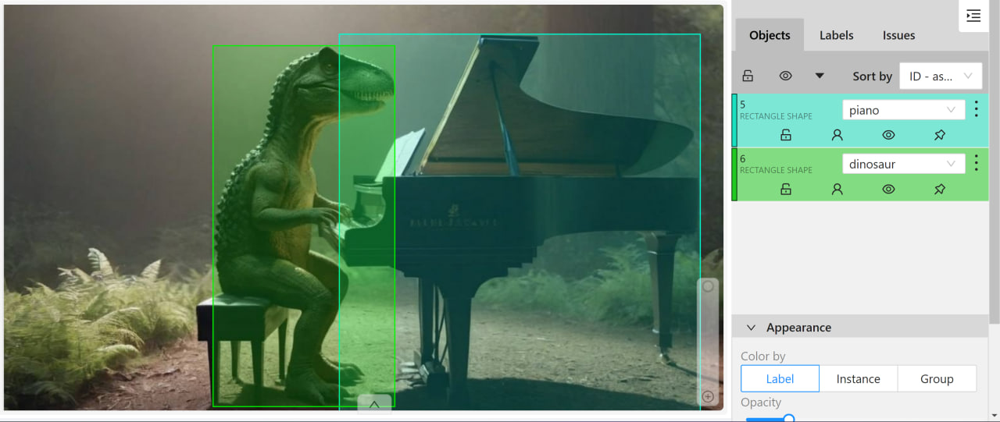

# __Auto-labling CVAT__

Creating __automatic annotation in CVAT__ using pre-trained [ultralytics models][1]. It supports both bounding box annotation for __object detection__ tasks and polygon annotation for __instance segmentation__ tasks.

You need to provide the path to the folder with images that will be uploaded to the task in CVAT. As a result of the program's operation, a zip archive with annotations obtained based on the neural network inference will be formed.

All that remains to be done: after creating the task, go to the Actions panel and select `Upload annotations`. Then, choose `COCO 1.0` in the `Import format` section and upload the archive.


## Installation:
You need to have Python 3.8 or newer installed.
Run the following commands sequentially in your terminal:

1. Clone this repository to your local machine.
2. Navigate to the created folder using the command cd.

Install all necessary libraries:

```pip install -r requirements.txt```

__This repository supports all relevant models from Ultralytics:__ YOLOv8/v9/v10 (and lower) for detection and segmentation, RT-DETR, FastSAM, and YOLO-World (Real-Time Open-Vocabulary Object Detection).

## How to run the code:
To interact with the repository, you need to set the following command in the cmd terminal:
```
python AutoCvat.py --img_folder="images" --weights=yolov8m-seg.pt --yaml_pth=config.yaml
```
An example of a more fine-tuning with all possible CLI parameters:
```
python AutoCvat.py --img_folder=images --weights=yolov8m-seg.pt --annotations_zip=cars_annotations --yaml_pth=config.yaml --all_conf=0.2 --cvat_json=True --save_photo=True --zero_shot_segmentation=False
```

Table 1. Explanation of CLI command values:

| № | Command               | Description                                                                                   | Default value|
|---|-----------------------|-----------------------------------------------------------------------------------------------|--------------|
| 1 | img_folder  | Path to the folder containing images of CVAT task                                               |  -           |
| 2 | weights     | Path to the ultralytics model weights file (ex: yolov8m-seg.pt, yolov9c.pt, FastSAM-x.pt)       |  -           |
| 3 | yaml_pth       | The path to configuration yaml file                                                          | config.yaml |
| 4 | annotations_zip       | Name of the COCO CVAT annotation zip archive produced by the program                  | annotations  |
| 5 | save_photo      | Whether to create a file .zip photos to upload to CVAT                                      | False        |
| 6 | cvat_json     | Should a json file with labels for CVAT be created                                            | False        |
| 7 | all_conf    | The value of the confidence of all model classes, condidences from config file don`t use        | None         |
| 8 | zero_shot_segmentation    | When set to True, it allows for zero-shot instance segmentation using SAM from any source detection network  | False |

For Russian users, there is a detailed video presentation of this project. YouTube video in Russian is available at this [link](https://www.youtube.com/watch?v=pyRvMj6JY_8).

## Configuration file

The project includes a configuration file that allows you to customize various parameters for your YOLO model, whether it's a custom or pretrained version. Here's a clearer breakdown of the settings available in this configuration file:

- CVAT Class Names Mapping (names): This parameter maps the class numbers from your model to the class names in your CVAT project, ensuring that the annotations are correctly labeled.

- Confidence Scores (confs): This parameter sets the confidence thresholds for each class in the model. Higher thresholds result in fewer potential objects being detected for each class, enhancing precision.

- Intersection over Union (iou): This parameter is used for Non-Maximum Suppression (NMS), helping to decide which bounding boxes to keep by setting a threshold for overlap between boxes.

- Image Size (imgsz): This parameter determines the size to which input images are resized during model inference, affecting the resolution and processing speed.

- Minimize Points (minimize_points): When set to True, this parameter reduces the number of points in the polygons of the final markup, which is recommended for efficiency and simplicity.

- Segment Parameter (segment): This parameter specifies the type of task you want to perform:
  - True: For instance segmentation, where the model identifies and outlines each instance of a class. Creates polygonal markup in CVAT.

   - False: For object detection, where the model identifies the presence of objects without delineating their exact boundaries.Creates bounding box markup in CVAT.

This configuration file provides a flexible way to tailor the model's behavior to your specific needs, ensuring that the model's output aligns with your project requirements.

Below is an example of a YAML configuration file:

```
names:
  0: person
  1: bicycle
  2: car
  3: motorcycle
  14: bird
confs:
  0: 0.7
  1: 0.4
  2: 0.4
  3: 0.5
  14: 0.6
iou: 0.7
imgsz: 640
minimize_points: False
segment: False
```
The keys in the "names" are the numbering of the classes in your model, and the values are the names in the CVAT project (`predictions.boxes.cls.cpu().int().tolist()`)
The keys in the "confs" are also the numbering of the classes, and the values are the confidence parameter of each class of the model.

**It is important to note that the number of confidentiality parameters must match the number of class names.**

If the "segment" parameter is set to True, but your model only supports detection, the output you will receive will be annotations from the detector. However, you can enable the --zero_shot_segmentation=True mode, which will allow the detection model to produce segmentation masks by using the detected bounding boxes as input prompts for a pre-trained neural network called SAM. The detailed explanation of this approach is provided in the "How to do Zero-shot instance segmentation for automatic annotation" section of the README.

**If you solve the detection issue, you do not need to use "minimize_points" parameter. It only applies to the segmentation task**

## Сlasses combining 
You can also combine several classes into one by giving them the same name in the configuration class, as in the example:

```
names:
  0: person
  2: car
  5: car
  7: car
  14: bird
confs:
  0: 0.7
  2: 0.4
  5: 0.4
  7: 0.5
  14: 0.3
iou: 0.7
imgsz: 640
minimize_points: True
segment: True
```
At the exit you will get:


If you need to get the annotations of specific classes from YOLO, then you can see their numbers:
[COCO classes supported by YOLO models][2] 

## Utilize Zero-shot object detectors for automatic annotation (YOLO-World)

To speed up your pipeline cycle of annotation, training and model improvement a good solution is to use the [YOLO-World model][3]. This model allows you to detect any object in the image based on descriptive texts.

To get started you need to install the clip library:

```pip install git+https://github.com/openai/CLIP.git```

After that, set the classes that you want to detect and save your custom model:
```python
from ultralytics import YOLO

# Initialize a YOLO-World model
model = YOLO("yolov8x-world.pt")  # or select yolov8m/s-world.pt

# Define custom classes
model.set_classes(["dinosaur", "piano"])

# Save the model with the defined offline vocabulary
model.save("custom_yolo-world.pt")
```
Then you can use AutoCvat to get the annotations using custom weights:



## How to do Zero-shot instance segmentation for automatic annotation
It is possible to transform any initial detection neural network into an instance segmentation network. The output detection boxes are fed as input prompts into the SAM (Segment Anything Model), which allows for the generation of hypothetical polygon contours of objects. As an example, this approach can be used in conjunction with the Zero-shot detector YOLO-World, enabling Zero-shot instance segmentation (similar to the Grounded SAM approach).

To activate this mode, you need to add `--zero_shot_segmentation=True` to the terminal command and specify `segment: True` in the YAML configuration file.

Example of using the instance segmenter network obtained from YOLO-world:

```
python AutoCvat.py --img_folder="images" --weights=custom_yolo-world.pt --yaml_pth=config.yaml --zero_shot_segmentation=True
```


## How to create lables for your CVAT project
If you will set cli command `--cvat_json=True`, you will get json file containing everything you need to create a project for your auto annotations.
The contents of the json file must be inserted in "Raw" in the header of the project you created in CVAT:


[1]: https://docs.ultralytics.com/models/
[2]: https://github.com/ultralytics/ultralytics/blob/main/ultralytics/cfg/datasets/coco.yaml
[3]: https://docs.ultralytics.com/models/yolo-world/
[4]: https://github.com/Koldim2001
